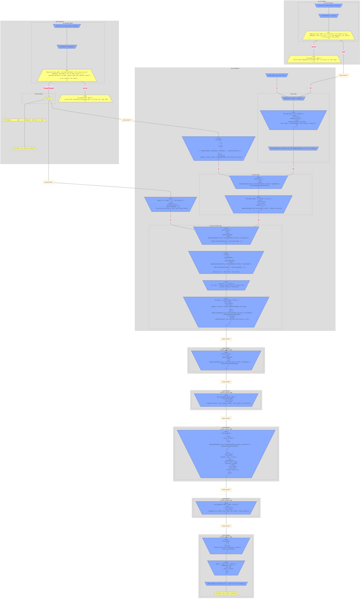

```mermaid
%%{init:{'theme':'base','themeVariables':{'clusterBkg':'#ddd','clusterBorder':'#888'}}}%%
flowchart TD
classDef pullClass fill:#8af,stroke:#000,text-align:left,white-space:pre
classDef pushClass fill:#ff8,stroke:#000,text-align:left,white-space:pre
linkStyle default stroke:#aaa,stroke-width:4px,color:red,font-size:1.5em;
subgraph sg_1v1 ["sg_1v1 stratum 0"]
    1v1[\"(1v1) <code>source_stream_serde(cl_inbound)</code>"/]:::pullClass
    2v1[\"(2v1) <code>map(Result::unwrap)</code>"/]:::pullClass
    4v1[/"<div style=text-align:center>(4v1)</div> <code>demux(|(cl_req, addr), var_args!(info, errs)| match cl_req {<br>    CKRequest::Info { id, key, .. } =&gt; info.give((key, (id, addr))),<br>    _ =&gt; errs.give((cl_req, addr)),<br>})</code>"\]:::pushClass
    5v1[/"<div style=text-align:center>(5v1)</div> <code>for_each(|(msg, addr)| {<br>    println!(&quot;KN: Unexpected CL message type: {:?} from {:?}&quot;, msg, addr)<br>})</code>"\]:::pushClass
    1v1--->2v1
    2v1--->4v1
    4v1--errs--->5v1
    subgraph sg_1v1_var_client_demux ["var <tt>client_demux</tt>"]
        1v1
        2v1
        4v1
    end
end
subgraph sg_2v1 ["sg_2v1 stratum 0"]
    24v1[\"<div style=text-align:center>(24v1)</div> <code>map(|(id, svc_addr, _, _, last_contact)| (<br>    id,<br>    DomPair::&lt;<br>        Max&lt;DateTime&lt;Utc&gt;&gt;,<br>        Point&lt;SocketAddr, ()&gt;,<br>    &gt;::new_from(last_contact, Point::new_from(svc_addr)),<br>))</code>"/]:::pullClass
    27v1[\"<div style=text-align:center>(27v1)</div> <code>flat_map(|<br>    (<br>        id,<br>        _,<br>        blocks,<br>        _,<br>        _,<br>    ): (SegmentNodeID, SocketAddr, Vec&lt;Block&gt;, _, Max&lt;DateTime&lt;Utc&gt;&gt;)|<br>{<br>    blocks<br>        .into_iter()<br>        .map(move |block| (block, SetUnionHashSet::new_from([id.clone()])))<br>})</code>"/]:::pullClass
    31v1[\"(31v1) <code>source_iter(init_keys)</code>"/]:::pullClass
    28v1[\"(28v1) <code>join::&lt;'tick, 'static&gt;()</code>"/]:::pullClass
    29v1[\"<div style=text-align:center>(29v1)</div> <code>flat_map(|(key, (cli, blocks))| {<br>    blocks<br>        .into_iter()<br>        .map(move |block| (<br>            block,<br>            MapUnionHashMap::new_from([<br>                (key.clone(), SetUnionHashSet::new_from([cli.clone()])),<br>            ]),<br>        ))<br>})</code>"/]:::pullClass
    30v1[\"(30v1) <code>inspect(|x| println!(&quot;{}: KN: LOOKUP_KEY_MAP: {x:?}&quot;, Utc::now()))</code>"/]:::pullClass
    25v1[\"<div style=text-align:center>(25v1)</div> <code>lattice_join::&lt;<br>    'tick,<br>    'static,<br>    MapUnionHashMap&lt;String, SetUnionHashSet&lt;(ClientID, SocketAddr)&gt;&gt;,<br>    SetUnionHashSet&lt;SegmentNodeID&gt;,<br>&gt;()</code>"/]:::pullClass
    26v1[\"<div style=text-align:center>(26v1)</div> <code>flat_map(|(block, (clikeyset, sn_set))| {<br>    sn_set<br>        .into_reveal()<br>        .into_iter()<br>        .map(move |sn| (<br>            sn,<br>            MapUnionHashMap::new_from([(block.clone(), clikeyset.clone())]),<br>        ))<br>})</code>"/]:::pullClass
    12v1[\"<div style=text-align:center>(12v1)</div> <code>lattice_join::&lt;<br>    'tick,<br>    'static,<br>    MapUnionHashMap&lt;<br>        Block,<br>        MapUnionHashMap&lt;String, SetUnionHashSet&lt;(ClientID, SocketAddr)&gt;&gt;,<br>    &gt;,<br>    DomPair&lt;Max&lt;DateTime&lt;Utc&gt;&gt;, Point&lt;SocketAddr, ()&gt;&gt;,<br>&gt;()</code>"/]:::pullClass
    13v1[\"<div style=text-align:center>(13v1)</div> <code>inspect(|<br>    x: &amp;(<br>        SegmentNodeID,<br>        (<br>            MapUnionHashMap&lt;<br>                Block,<br>                MapUnionHashMap&lt;String, SetUnionHashSet&lt;(ClientID, SocketAddr)&gt;&gt;,<br>            &gt;,<br>            DomPair&lt;Max&lt;DateTime&lt;Utc&gt;&gt;, Point&lt;SocketAddr, ()&gt;&gt;,<br>        ),<br>    )|<br>println!(&quot;{}: &lt;- LCM: {x:?}&quot;, Utc::now()))</code>"/]:::pullClass
    14v1[\"<div style=text-align:center>(14v1)</div> <code>filter(|(_, (_, hbts))| {<br>    Utc::now() - *hbts.as_reveal_ref().0.as_reveal_ref()<br>        &lt; chrono::Duration::seconds(10)<br>})</code>"/]:::pullClass
    15v1[\"<div style=text-align:center>(15v1)</div> <code>flat_map(|(_, (block_clikey, hbts))| {<br>    block_clikey<br>        .into_reveal()<br>        .into_iter()<br>        .map(move |(block, clikeys)| MapUnionHashMap::new_from([<br>            (<br>                block,<br>                Pair::&lt;<br>                    MapUnionHashMap&lt;String, SetUnionHashSet&lt;(ClientID, SocketAddr)&gt;&gt;,<br>                    SetUnionHashSet&lt;SocketAddr&gt;,<br>                &gt;::new_from(<br>                    clikeys,<br>                    SetUnionHashSet::new_from([hbts.into_reveal().1.val]),<br>                ),<br>            ),<br>        ]))<br>})</code>"/]:::pullClass
    24v1--1--->12v1
    27v1--1--->25v1
    31v1--1--->28v1
    28v1--->29v1
    29v1--->30v1
    30v1--0--->25v1
    25v1--->26v1
    26v1--0--->12v1
    12v1--->13v1
    13v1--->14v1
    14v1--->15v1
    subgraph sg_2v1_var_block_map ["var <tt>block_map</tt>"]
        25v1
        26v1
    end
    subgraph sg_2v1_var_key_map ["var <tt>key_map</tt>"]
        28v1
        29v1
        30v1
    end
    subgraph sg_2v1_var_last_contact_map ["var <tt>last_contact_map</tt>"]
        12v1
        13v1
        14v1
        15v1
    end
end
subgraph sg_3v1 ["sg_3v1 stratum 1"]
    16v1[\"<div style=text-align:center>(16v1)</div> <code>lattice_fold::&lt;<br>    'tick,<br>    MapUnionHashMap&lt;<br>        Block,<br>        Pair&lt;<br>            MapUnionHashMap&lt;String, SetUnionHashSet&lt;(ClientID, SocketAddr)&gt;&gt;,<br>            SetUnionHashSet&lt;SocketAddr&gt;,<br>        &gt;,<br>    &gt;,<br>&gt;()</code>"/]:::pullClass
    subgraph sg_3v1_var_last_contact_map ["var <tt>last_contact_map</tt>"]
        16v1
    end
end
subgraph sg_4v1 ["sg_4v1 stratum 1"]
    17v1[\"<div style=text-align:center>(17v1)</div> <code>flat_map(|block_keycli_addr| {<br>    block_keycli_addr<br>        .into_reveal()<br>        .into_iter()<br>        .map(move |(block, req_sn_addrs)| (block, req_sn_addrs.into_reveal()))<br>})</code>"/]:::pullClass
    subgraph sg_4v1_var_last_contact_map ["var <tt>last_contact_map</tt>"]
        17v1
    end
end
subgraph sg_5v1 ["sg_5v1 stratum 1"]
    18v1[\"<div style=text-align:center>(18v1)</div> <code>flat_map(move |<br>    (<br>        block,<br>        (reqs, sn_addrs),<br>    ): (<br>        Block,<br>        (<br>            MapUnionHashMap&lt;String, SetUnionHashSet&lt;(ClientID, SocketAddr)&gt;&gt;,<br>            SetUnionHashSet&lt;SocketAddr&gt;,<br>        ),<br>    )|<br>{<br>    reqs<br>        .into_reveal()<br>        .into_iter()<br>        .map(move |(key, cliset)| (<br>            key,<br>            LocatedBlock {<br>                block: block.clone(),<br>                locations: sn_addrs<br>                    .clone()<br>                    .into_reveal()<br>                    .into_iter()<br>                    .collect::&lt;Vec&lt;_&gt;&gt;(),<br>            },<br>            cliset,<br>        ))<br>})</code>"/]:::pullClass
    subgraph sg_5v1_var_last_contact_map ["var <tt>last_contact_map</tt>"]
        18v1
    end
end
subgraph sg_6v1 ["sg_6v1 stratum 1"]
    19v1[\"<div style=text-align:center>(19v1)</div> <code>flat_map(move |(key, lblock, cliset)| {<br>    cliset<br>        .into_reveal()<br>        .into_iter()<br>        .map(move |(id, addr)| ((id, addr, key.clone()), lblock.clone()))<br>})</code>"/]:::pullClass
    subgraph sg_6v1_var_last_contact_map ["var <tt>last_contact_map</tt>"]
        19v1
    end
end
subgraph sg_7v1 ["sg_7v1 stratum 2"]
    20v1[\"<div style=text-align:center>(20v1)</div> <code>fold_keyed::&lt;<br>    'tick,<br>&gt;(<br>    Vec::new,<br>    |lblocks: &amp;mut Vec&lt;LocatedBlock&gt;, lblock| {<br>        lblocks.push(lblock);<br>    },<br>)</code>"/]:::pullClass
    21v1[\"<div style=text-align:center>(21v1)</div> <code>map(|((_, addr, key), lblocks)| (<br>    CKResponse::Info {<br>        key: key,<br>        blocks: lblocks,<br>    },<br>    addr,<br>))</code>"/]:::pullClass
    22v1[\"(22v1) <code>inspect(|x| println!(&quot;{}: -&gt; LCM: {x:?}&quot;, Utc::now()))</code>"/]:::pullClass
    23v1[/"(23v1) <code>dest_sink_serde(cl_outbound)</code>"\]:::pushClass
    20v1--->21v1
    21v1--->22v1
    22v1--->23v1
    subgraph sg_7v1_var_last_contact_map ["var <tt>last_contact_map</tt>"]
        20v1
        21v1
        22v1
        23v1
    end
end
subgraph sg_8v1 ["sg_8v1 stratum 0"]
    6v1[\"(6v1) <code>source_stream_serde(sn_inbound)</code>"/]:::pullClass
    7v1[\"(7v1) <code>map(|m| m.unwrap())</code>"/]:::pullClass
    8v1[/"<div style=text-align:center>(8v1)</div> <code>demux(|(sn_req, addr), var_args!(heartbeat, errs)| match sn_req {<br>    SKRequest::Heartbeat { id, svc_addr, blocks } =&gt; {<br>        heartbeat.give((id, svc_addr, blocks, addr, Max::new(Utc::now())))<br>    }<br>    _ =&gt; errs.give((sn_req, addr)),<br>})</code>"\]:::pushClass
    9v1[/"(9v1) <code>tee()</code>"\]:::pushClass
    10v1[/"(10v1) <code>map(|(_, _, _, addr, _)| (SKResponse::Heartbeat {}, addr))</code>"\]:::pushClass
    11v1[/"(11v1) <code>dest_sink_serde(sn_outbound)</code>"\]:::pushClass
    32v1[/"<div style=text-align:center>(32v1)</div> <code>for_each(|(msg, addr)| {<br>    println!(&quot;KN: Unexpected SN message type: {:?} from {:?}&quot;, msg, addr)<br>})</code>"\]:::pushClass
    6v1--->7v1
    7v1--->8v1
    8v1--heartbeat--->9v1
    8v1--errs--->32v1
    9v1--->10v1
    10v1--->11v1
    subgraph sg_8v1_var_heartbeats ["var <tt>heartbeats</tt>"]
        9v1
    end
    subgraph sg_8v1_var_segnode_demux ["var <tt>segnode_demux</tt>"]
        6v1
        7v1
        8v1
    end
end
4v1--info--->33v1
9v1--->39v1
9v1--->40v1
15v1--->38v1
16v1--->37v1
17v1--->36v1
18v1--->35v1
19v1--->34v1
33v1["(33v1) <code>handoff</code>"]:::otherClass
33v1--0--->28v1
34v1["(34v1) <code>handoff</code>"]:::otherClass
34v1===o20v1
35v1["(35v1) <code>handoff</code>"]:::otherClass
35v1--->19v1
36v1["(36v1) <code>handoff</code>"]:::otherClass
36v1--->18v1
37v1["(37v1) <code>handoff</code>"]:::otherClass
37v1--->17v1
38v1["(38v1) <code>handoff</code>"]:::otherClass
38v1===o16v1
39v1["(39v1) <code>handoff</code>"]:::otherClass
39v1--->24v1
40v1["(40v1) <code>handoff</code>"]:::otherClass
40v1--->27v1
```
